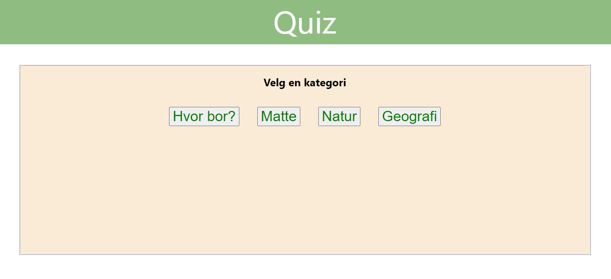

<h1>Sommerprosjekt 2020</h1>

  
Dette prosjeket er mitt første react-prosjekt. Tidligere har jeg vært borte i react-simplified (sykkelutleie-prosjekt) men denne gangen har jeg brukt react hooks.  

  
  
Quizzes er en enkel quiz og består av de grunnleggende funksjoner slik som valg av kategori, ulike alternativer, en score-teller osv.. 

  

